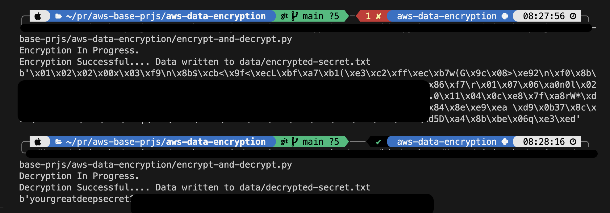

# AWS KMS Encryption/Decryption with Python

## Overview

This script demonstrates how to encrypt and decrypt data using AWS Key Management Service (KMS).

## Steps

1. Go to the AWS console and create a customer-managed key.

2. Download the key ID and paste it into the `key.txt` file in the `./secrets/` directory.
3. Rename `.env.example` to `.env`.
4. Obtain your AWS access key ID and secret access key from your AWS account and add them to the `.env` file.
5. Run the encryption function and observe the new file created in the `data` directory. Note that it is raw bytes format and would not be sensible.

6. In the main section of the [`encrypt-and-decrypt.py`](encrypt-and-decrypt.py) Comment the encrypt_data function call and Uncomment the decryption call to verify that your data is safely retrieved.

## Sample Output Logs.

7. If this was just for test purposes **remember to delete** the key(s) created by going to the console and scheduling the delete for the shortest possible period. see below. (Optionally we can do this with cloudformation or terraform.)

